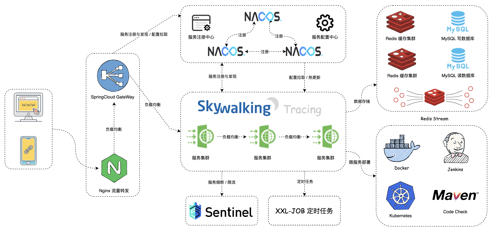
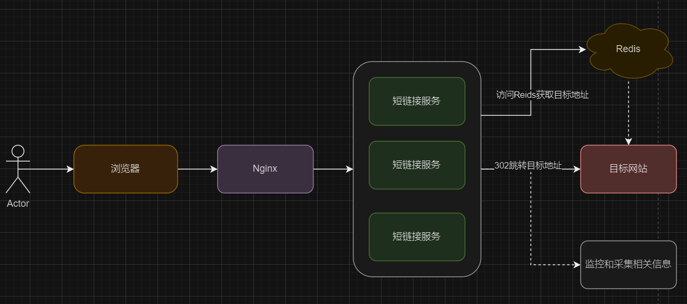

# 项目介绍
>核心技术：SpringBoot + SpringCloudAlibaba + RocketMQ + ShardingSphere + Redis + MySQL + Sentinel
> 
>项目描述：SaaS 短链接系统，为企业和个人用户提供了一个高效、安全和可靠的短链接管理平台。该平台不仅简化了长链接的管理和分享过程，还提供了深入的分析和跟踪功能，用户可以灵活地管理和优化其链接，从而实现更好的营销效果和业务成果。

短链接：就是将原始的长URL通过特定的服务转换为短URL，通过访问短URL跳转到长URL

Saas短链接：Saas系统就不用下载，直接访问的系统，用户可以通过付费或者订阅的方式使用Saas短链接系统，可以创建和管理自定义的短链接，同时获得有关短链接的统计数据，比如说点击次数，地理位置，设备信息等等。


# 系统架构


# 一、短链接后台管理模块

> 这个部分主要涉及到用户模块，用户注册，用户分库分表，敏感数据的加密存储，用户登陆，短链接分组，批量创建短链接

# 短链接模块
## 01短链接跳转原理
> 入口（Nginx）把请求打到短链服务 → 服务从 Redis 查到长链 → 返回 302 + Location → 浏览器自己去目标网站；同时把点击数据异步送到监控系统。
 
1. 用户/浏览器
- 发送HTTP请求，例如https://sho.rt/abc123

2. Nginx（边缘入口/网关）
- 负责 TLS 终止、限流、WAF、反向代理、负载均衡到后面的短链接服务实例。
- 也可以做少量静态 404/故障页兜底。

3. 短链接服务（多实例）
- 收到 /{slug}（例如 abc123），先解析租户/自定义域与 slug。
- 访问 Redis：按 slug → longUrl 的 K/V 查映射（图中“访问 Redis 获取目标地址”）。
- 命中：进行合法性与过期校验；
- 未命中：通常会回源数据库并回填 Redis（这一步没画在图里，但线上必须有）。
- 写埋点到监控/采集系统（图右下，通常经队列异步写，不阻塞跳转）。 

4. 返回 302
- 服务不直接去“请求目标网站”，而是给浏览器返回一个 HTTP 302，Location 指向原始长链（图里“302 跳转目标地址”是概念连线）。
- 浏览器拿到 302 后，自动再发起一次请求到 目标网站。

5. 目标网站
- 接收浏览器的二次请求，正常响应页面。
- 目标站也可能有自己的监控/统计（图中虚线）。

> tips: 实线表示有直接因果关系，虚线表示有间接因果关系 


### 重定向使用301和302的思考
短链接跳转默认用 302（或 307）：
- 需要统计、A/B、可回滚、目的地可能会改，这些都是短链的常态 → 选 临时重定向。

只有当映射“永远不会再改”时才用 301（或 308）：
- 典型是站点改版、域名迁移、URL 规范化（SEO 场景）→ 选 永久重定向。
## 02短链接数据库部分

这里关于短链接唯一的思考，要考虑是全局唯一，还是域名下唯一
- 全局唯一：单一短链接保证在所有域名下唯一
- 域名下唯一：单一短链接仅仅保证域名下唯一，这里也就是域名+短链接组合唯一

所以我这里考虑使用域名下唯一的。那么到数据库中操作，一般有两种方案
- 建立domain（域名）和 shor_uri（短链接）的联合索引
- 直接对字段full_short_url进行索引

新增一个full_short_url可能会有一些冗余，但是出于查询效率的考虑（后续可能会频繁对该字段进行查询），所以直接对该字段进行联合唯一索引

```sql
CREATE TABLE `t_link` (
  `id` bigint(20) NOT NULL AUTO_INCREMENT COMMENT 'ID',
  `domain` varchar(128) DEFAULT NULL COMMENT '域名',
  `short_uri` varchar(8) DEFAULT NULL COMMENT '短链接',
  `full_short_url` varchar(128) DEFAULT NULL COMMENT '完整短链接',
  `origin_url` varchar(1024) DEFAULT NULL COMMENT '原始链接',
	`click_num` int(11) DEFAULT 0 COMMENT '点击量',
	`gid` varchar(32) DEFAULT NULL COMMENT '分组标识',
	`enable_status` tinyint(1) DEFAULT NULL COMMENT '启用标识 0：未启用 1：已启用',
	`created_type` tinyint(1) DEFAULT NULL COMMENT '创建类型 0：控制台 1：接口',
	`valid_date_type` tinyint(1) DEFAULT NULL COMMENT '有效期类型 0：永久有效 1：用户自定义',
	`valid_date` datetime DEFAULT NULL COMMENT '有效期',
	`describe` varchar(1024) DEFAULT NULL COMMENT '描述',
  `create_time` datetime DEFAULT NULL COMMENT '创建时间',
  `update_time` datetime DEFAULT NULL COMMENT '修改时间',
  `del_flag` tinyint(1) DEFAULT NULL COMMENT '删除标识 0：未删除 1：已删除',
  PRIMARY KEY (`id`),
  UNIQUE KEY `idx_unique_full_short_uri` (`full_short_uri`) USING BTREE
) ENGINE=InnoDB DEFAULT CHARSET=utf8mb4;
```


# 学习收获
完成后台管理的搭建，从0到1开发了后台管理系统，锻炼自己常用接口的编写能力，学习作者的开发架构，逐渐规范开发。

学习到了一些工具的使用，例如ApiFox进行接口测试及管理，使用draw.io进行绘制流程图，使用git进行项目开发的记录...


# 学习来源
https://gitee.com/nageoffer/shortlink
