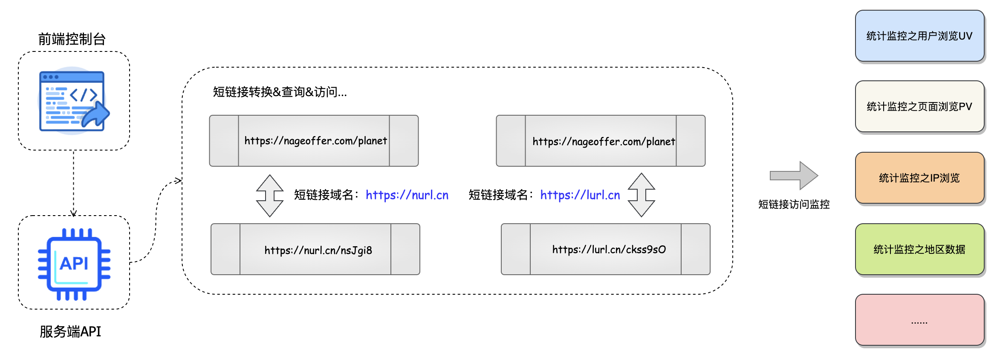
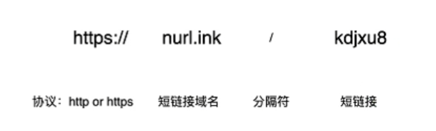
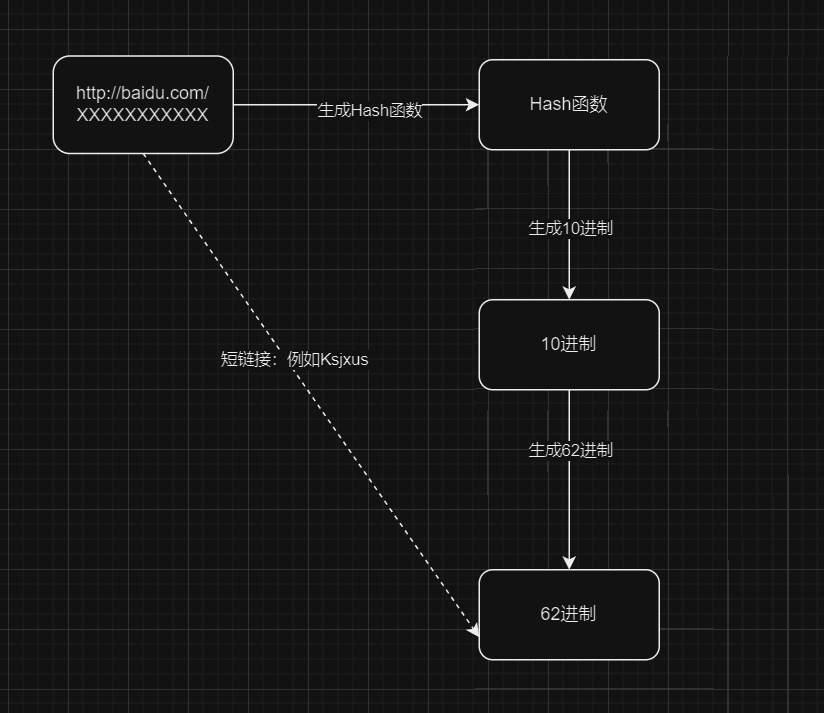
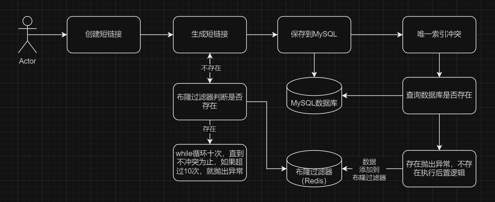

# 仿微博短链接平台
# 项目介绍
>核心技术：SpringBoot + SpringCloudAlibaba + RocketMQ + ShardingSphere + Redis + MySQL + Sentinel
> 
>项目描述：一个SaaS 短链接系统，为企业和个人用户提供了一个高效、安全和可靠的短链接管理平台。该平台不仅简化了长链接的管理和分享过程，还提供了深入的分析和跟踪功能，用户可以灵活地管理和优化其链接，从而实现更好的营销效果和业务成果。

短链接：就是将原始的长URL通过特定的服务转换为短URL，通过访问短URL跳转到长URL

Saas系统(Software as a Service 软件即服务) ：用户不用自己买服务器、安装软件，而是通过 浏览器或客户端直接使用服务，按需付费。如果这样说，那和web网站有什么区别？别急，往后看

Saas和web网站有什么区别：Saas系统是将软件功能作为服务，是“软件产品”，用户通过订阅或者付费去使用，不是简单信息展示，更加强调“软件替代方案”。而普通的Web网站，更像是一种服务平台。

Saas短链接：Saas系统就不用下载，直接访问的系统，用户可以通过付费或者订阅的方式使用Saas短链接系统，可以创建和管理自定义的短链接，同时获得有关短链接的统计数据，比如说点击次数，地理位置，设备信息等等。



# 系统架构


# 一、短链接后台管理模块

> 这个部分主要涉及到用户模块，用户注册，用户分库分表，敏感数据的加密存储，用户登陆，短链接分组，批量创建短链接

# 二、短链接模块
## 01短链接跳转原理
> 入口（Nginx）把请求打到短链服务 → 服务从 Redis 查到长链 → 返回 302 + Location → 浏览器自己去目标网站；同时把点击数据异步送到监控系统。
 
1. 用户/浏览器
- 发送HTTP请求，例如https://sho.rt/abc123

2. Nginx（边缘入口/网关）
- 负责 TLS 终止、限流、WAF、反向代理、负载均衡到后面的短链接服务实例。
- 也可以做少量静态 404/故障页兜底。

3. 短链接服务（多实例）
- 收到 /{slug}（例如 abc123），先解析租户/自定义域与 slug。
- 访问 Redis：按 slug → longUrl 的 K/V 查映射（图中“访问 Redis 获取目标地址”）。
- 命中：进行合法性与过期校验；
- 未命中：通常会回源数据库并回填 Redis（这一步没画在图里，但线上必须有）。
- 写埋点到监控/采集系统（图右下，通常经队列异步写，不阻塞跳转）。 

4. 返回 302
- 服务不直接去“请求目标网站”，而是给浏览器返回一个 HTTP 302，Location 指向原始长链（图里“302 跳转目标地址”是概念连线）。
- 浏览器拿到 302 后，自动再发起一次请求到 目标网站。

5. 目标网站
- 接收浏览器的二次请求，正常响应页面。
- 目标站也可能有自己的监控/统计（图中虚线）。

> tips: 实线表示有直接因果关系，虚线表示有间接因果关系 


### 重定向使用301和302的思考
短链接跳转默认用 302（或 307）：
- 需要统计、A/B、可回滚、目的地可能会改，这些都是短链的常态 → 选 临时重定向。

只有当映射“永远不会再改”时才用 301（或 308）：
- 典型是站点改版、域名迁移、URL 规范化（SEO 场景）→ 选 永久重定向。
## 02短链接表结构

这里关于短链接唯一的思考，要考虑是全局唯一，还是域名下唯一
- 全局唯一：单一短链接保证在所有域名下唯一
- 域名下唯一：单一短链接仅仅保证域名下唯一，这里也就是域名+短链接组合唯一

所以我这里考虑使用域名下唯一的。那么到数据库中操作，一般有两种方案
- 建立domain（域名）和 shor_uri（短链接）的联合索引
- 直接对字段full_short_url进行索引

新增一个full_short_url可能会有一些冗余，但是出于查询效率的考虑（后续可能会频繁对该字段进行查询），所以直接对该字段进行联合唯一索引

这里有一个注意点就是short_uri的编码要设置为utf8-bin,这样是区分大小写，否则使用默认的是不区分大小写的
### 03 短链接生成算法
短链接是由协议+短链接域名+短链接组成，其中需要思考的点是短链接如何获取，也就是如何将原来的长连接转换短链接。


短链接的核心目标是：
- 把一个很长的 URL（如 https://example.com/a/b/c?id=123&token=xxxxx）转换成一个 短的字符串（如 https://t.cn/AbCdEf）。
- 这个短字符串在系统中唯一，能映射回原始 URL。

常见的方法有：哈希算法，自增ID+进制转换，随机生成（UUID），Hash+数据库校验，分布式唯一ID方案。

这里考虑使用独特的Hash算法生成10进制数，然后再转换到62进制

```java
/**
     * 生成给短链接
     * @param requestParam 请求参数
     * @return 返回短链接
     */
    private String generateSuffix(ShortLinkCreateReqDTO requestParam){
        String originUrl = requestParam.getOriginUrl();
        return HashUtil.hashToBase62(originUrl);
    }
```
一开始就是通过工具类进行生成短链接，考虑到会有冲突，所以判断冲突，如果冲突再次生成，但是这样可能有机会造成死循环或者重复次数过多影响程序的性能，所以统计冲突次数，如果冲突次数达到一定数量就不再比较。

```java
/**
 * 生成给短链接
 * @param requestParam 请求参数
 * @return 返回短链接
 */
private String generateSuffix(ShortLinkCreateReqDTO requestParam){
    int customGenerateCount = 0;
    String shortUri;
    while(true){
        if(customGenerateCount > 10){
            throw new ServiceException("短链接频繁生成， 请稍后再试");
        }
        String originUrl = requestParam.getOriginUrl();
        shortUri = HashUtil.hashToBase62(originUrl);
        LambdaQueryWrapper<ShortLinkDO> queryWrapper = Wrappers.lambdaQuery(ShortLinkDO.class)
                .eq(ShortLinkDO::getFullShortUrl, requestParam.getDomain() + "/" + shortUri);
        ShortLinkDO shortLinkDO = baseMapper.selectOne(queryWrapper);
        if(shortLinkDO == null){
            break;
        }
    }
    return shortUri;

}
```
上述方法有一些问题，使用的生成算法是固定的，就是如果数据库中存在一定会造成循环，此外，由于是到数据库中进行查询，所以并发支持不友好，需要考虑缓存。这里使用布隆过滤器去进行判断。

添加RBloomFilterConfiguration配置，然后通过构造器注入，注入



创建短链接的完整过程



对数据库t_link进行分库分表

# 学习收获
完成后台管理的搭建，从0到1开发了后台管理系统，锻炼自己常用接口的编写能力，学习作者的开发架构，逐渐规范开发。

学习到了一些工具的使用，例如ApiFox进行接口测试及管理，使用draw.io进行绘制流程图，使用git进行项目开发的记录

熟悉了restful api，Mybatis-plus


# 知识积累

## 什么是工具类？
- 专门存放静态方法的类；

- 用来封装一些 常用的、通用的功能；

- 不依赖具体业务，在多个地方都能复用。

这个项目里面用到的工具类其实挺多的，比如说再生成短链接的时候用到的HashUtil就是一个工具类。

## VO和DTO之间的关系

项目开发中，习惯将DTO分为两类，resp和req, 然后分创建其响应的对象，例如CreateShortLinkDTO等等，这些对象其实就是复制了VO中的一些字段，也就是选择VO中用到的字段。
DTO中resp包下的对象就是作为Controller中的请求参数

# 学习来源
https://gitee.com/nageoffer/shortlink


